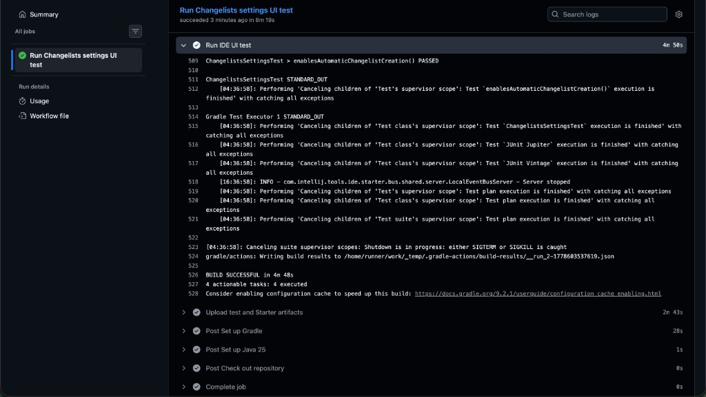

# JetBrains Integration UI Tests

[](https://github.com/v-ya-ch-e/jetbrains-integration-ui-tests/actions/workflows/ci.yml)

Kotlin/JUnit 5 project that demonstrates JetBrains IDE Starter integration UI tests.

The test opens IntelliJ IDEA Ultimate with a pinned public Gradle project (`jitpack/gradle-simple` at commit `abbeb794eb3ae7d9926f5bd7de58477abcbaa906`), navigates to **Settings...** > **Version Control** > **Changelists**, enables **Create changelists automatically**, verifies the checkbox is selected, and confirms the dialog with **OK**.

The bonus tests use their own IDEA Ultimate launch configuration and verify that additional Settings pages from **Editor** render correctly: **Editor**, **Editor** > **Font**, and **Editor** > **Color Scheme**.

See [`docs/TASK_DESCRIPTION.md`](docs/TASK_DESCRIPTION.md) for the original task and [`docs/starter-docs/`](docs/starter-docs/) for the copied Starter reference notes used while implementing it.

## For Reviewers

- Requirement checklist: [`docs/TASK_DESCRIPTION.md`](docs/TASK_DESCRIPTION.md)
- Main UI test: [`src/test/kotlin/com/example/jetbrains/integration/ChangelistsSettingsTest.kt`](src/test/kotlin/com/example/jetbrains/integration/ChangelistsSettingsTest.kt)
- Bonus UI tests: [`src/test/kotlin/com/example/jetbrains/integration/BonusTests.kt`](src/test/kotlin/com/example/jetbrains/integration/BonusTests.kt)
- Main test configuration: [`src/test/kotlin/com/example/jetbrains/integration/ChangelistsSettingsConfig.kt`](src/test/kotlin/com/example/jetbrains/integration/ChangelistsSettingsConfig.kt)
- Bonus test configuration: [`src/test/kotlin/com/example/jetbrains/integration/BonusTestsConfig.kt`](src/test/kotlin/com/example/jetbrains/integration/BonusTestsConfig.kt)
- Fast validation: `./gradlew testClasses`
- Full validation: run the UI tests locally or via the manual GitHub Actions workflows when a GUI environment and license are available.

## Tech Stack

- Kotlin 2.3
- JUnit 5
- Gradle 9.2.1 wrapper
- JetBrains IDE Starter and Driver snapshots
- IntelliJ IDEA Ultimate launched by Starter as the IDE under test

## GitHub Actions CI

This repository uses three GitHub Actions workflows:

- [`ci.yml`](.github/workflows/ci.yml) runs on pushes and pull requests and executes `./gradlew testClasses`. It verifies that the Kotlin test code compiles against the resolved JetBrains Starter and Driver APIs without launching an IDE.
- [`ui-test.yml`](.github/workflows/ui-test.yml) is a manual `workflow_dispatch` workflow for the main Changelists IDE UI scenario. It runs the test under Xvfb, reads `LICENSE_KEY` from GitHub Secrets, and uploads test/Starter artifacts for debugging.
- [`bonus-ui-tests.yml`](.github/workflows/bonus-ui-tests.yml) is a separate manual `workflow_dispatch` workflow for the bonus Settings UI scenarios.

The full UI tests are intentionally not required pull request gates because they download and start a full IDE, need a desktop-like environment, can require an IntelliJ IDEA Ultimate license, and depend on moving EAP snapshot artifacts.

### Full UI Test Evidence

The manual workflow has been run successfully in GitHub Actions: [Run Changelists settings UI test](https://github.com/v-ya-ch-e/jetbrains-integration-ui-tests/actions/runs/25748055373). The job log shows that GitHub Actions executed:

```shell
xvfb-run -a ./gradlew test --tests com.example.jetbrains.integration.ChangelistsSettingsTest --rerun-tasks --no-daemon
```

The same log contains `ChangelistsSettingsTest > enablesAutomaticChangelistCreation() PASSED` and `BUILD SUCCESSFUL in 4m 48s`, confirming that the full IDE UI test was performed on the runner.



## Prerequisites

- A desktop environment where a JetBrains IDE can be launched.
- Network access for Gradle dependencies, the IDE download, and the public sample project checkout.
- Java 25. The Gradle build is configured with the Foojay toolchain resolver, so Gradle can provision it automatically when needed.
- `LICENSE_KEY` in the environment if the downloaded IntelliJ IDEA Ultimate build requires a license in your environment.

## Run Locally

Compile the project and test classes:

```shell
./gradlew testClasses
```

Run the integration UI test:

```shell
./gradlew test --tests com.example.jetbrains.integration.ChangelistsSettingsTest --rerun-tasks
```

Run the bonus Settings UI tests:

```shell
./gradlew test --tests com.example.jetbrains.integration.BonusTests --rerun-tasks
```

The UI tests download and start an IDE, import a public GitHub project, and write Starter artifacts under ignored local directories such as `out/` and `build/`. A full run can take several minutes on a fresh machine.

The project uses JetBrains Starter and Driver `LATEST-EAP-SNAPSHOT` dependencies to match current Starter examples. For long-term archival reproducibility, pinning those snapshots to fixed versions would be the next step.

## Project Layout

- `build.gradle.kts` configures Kotlin, JUnit 5, and the direct JetBrains IDE Starter/Driver dependencies.
- `settings.gradle.kts` configures plugin and dependency repositories required by Starter snapshots.
- `src/test/kotlin/com/example/jetbrains/integration/ChangelistsSettingsTest.kt` contains the integration UI test.
- `src/test/kotlin/com/example/jetbrains/integration/ChangelistsSettingsConfig.kt` contains the IDE, project, and UI labels used by the main test.
- `src/test/kotlin/com/example/jetbrains/integration/BonusTests.kt` contains the bonus Settings UI tests.
- `src/test/kotlin/com/example/jetbrains/integration/BonusTestsConfig.kt` contains the IDE, project, and UI labels used by the bonus tests.
- `docs/` contains the task description and local copies of Starter reference material.
- `docs/assets/` contains README images, including the GitHub Actions UI test screenshot.
- `AGENTS.md` and `CLAUDE.md` contain repository guidance for automated coding assistants and are not required to run the test.

## License

This project is available under the MIT License. See [`LICENSE`](LICENSE).
